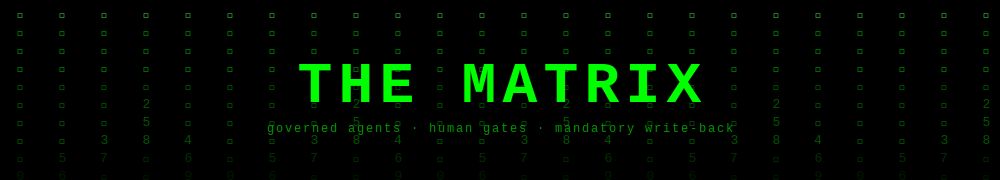

<p align="center">
  
</p>

> ⚠️ **Work in progress. Use at your own risk.**

[](LICENSE)
[](https://claude.ai/code)
[](https://github.com/Felipebetini/TheMatrix-cs/blob/main/SETUP.md)

An open-source template for running a team of AI agents that handle support tickets. Every risky step requires human approval. Every resolved ticket writes knowledge back to your local files. Works with Claude, Codex, or Gemini.

---

<!-- DEMO VIDEO -->
<!-- Record and drop your video here. Suggested scenes:
     1. dashboard.sh — Matrix rain, live tool log
     2. ./scripts/matrix.sh — Smith greeting, ticket intake
     3. The pipeline running — agent names flipping on the dashboard
     4. The Ralph Loop blocking exit — the money shot -->

---

<details>
<summary><strong>Table of contents</strong></summary>

- [Quick start](#quick-start)
- [Versioning](#versioning)
- [Adapting it to your team](#adapting-it-to-your-team)
- [It grows with every ticket](#it-grows-with-every-ticket)
- [Works with any LLM](#works-with-any-llm)
- [The live dashboard](#the-live-dashboard)
- [Repository structure](#repository-structure)
- [How it works](ARCHITECTURE.md)
- [Design principles](#design-principles)
- [References](#references)

</details>

---

## Quick start

Install at least one AI CLI (any combination works):

```bash
npm install -g @anthropic-ai/claude-code   # Claude CLI (full tool support)
npm install -g @openai/codex               # Codex CLI (fast execution, strong coding workflow)
npm install -g @google/gemini-cli          # Gemini CLI (large-context research; fewer write capabilities)
```

**Clone and run:**

```bash
git clone https://github.com/Felipebetini/TheMatrix-cs.git
cd TheMatrix-cs
chmod +x scripts/*.sh
./scripts/matrix.sh
```

**Usage patterns:**

```bash
./scripts/matrix.sh                        # asks which project, then which LLM
./scripts/matrix.sh my-project             # pre-loads project, asks which LLM
./scripts/matrix.sh my-project claude      # force Claude
./scripts/matrix.sh my-project codex       # force Codex
./scripts/matrix.sh my-project gemini      # force Gemini
./scripts/activate.sh status               # check which CLIs are installed
```

**Dashboard (beta):**

```bash
./scripts/dashboard.sh          # start and open browser at localhost:2025
./scripts/dashboard.sh test     # start in preview/test mode
./scripts/dashboard.sh stop     # kill the server
```

Keep the dashboard open on a second screen while the agent works in your terminal.

**Install local quality gates (recommended):**

```bash
./scripts/install-git-hooks.sh
```

This installs a `pre-commit` hook that runs:
- `scripts/pr-check.sh`
- `scripts/health-check.sh --quick`


For live token telemetry:

```bash
# Codex hooks are auto-installed the first time you launch Codex via matrix.sh/activate.sh.
# Optional manual fallback:
./scripts/setup-codex-hooks.sh
```

If hooks were installed during launch, restart Codex sessions so they take effect.

The dashboard supports per-session monitoring via a session selector in the header, so parallel tickets (e.g. Claude + Codex in separate terminals) can be observed independently.

**What the LLM selection looks like:**

```
  Which AI?
  [1] Claude  -- full file tools, write-back, interactive  (default)
  [2] Codex   -- pre-loaded context, produces diffs
  [3] Gemini  -- large context, research-heavy (limited write tools)

  >

Matrix: smith -> claude  |  project: my-project  |  context: 142 lines

Matrix online. Which project are we working on today?
```

**Verify the Ralph Loop works:**

```bash
touch /tmp/matrix-ticket.flag
# open a Claude Code session and try to exit -- it should be blocked
rm /tmp/matrix-ticket.flag
```

> **First run:** the launcher detects unconfigured state and walks you through setup automatically. Or run `./scripts/setup.sh` directly. See `SETUP.md` for the full guide.

---

<details>
<summary><strong>Versioning</strong></summary>

This repo uses Semantic Versioning.

- Current version: `VERSION`
- Release notes: `CHANGELOG.md`
- Bump helper: `./scripts/version.sh`

Examples:

```bash
./scripts/version.sh patch
./scripts/version.sh minor
./scripts/version.sh major --tag
```

`--tag` also commits `VERSION` + `CHANGELOG.md` and creates `vX.Y.Z` tag.

**GitHub Releases**

After pushing the version tag, publish a GitHub Release from that tag:
1. Open **Releases** in GitHub
2. Choose existing tag `vX.Y.Z`
3. Use the matching section from `CHANGELOG.md` as release notes
4. Publish

Historical releases can be created retroactively for older tags.

</details>

---

## Quality and safety gates

Phase-1 gates are enabled in this repo:

- **Local pre-commit gate** (installed by `scripts/install-git-hooks.sh`)
- **CI gate**: `.github/workflows/quality-gate.yml` on PRs and pushes to `main`
  - `health-check.sh --quick`
  - `pr-check.sh --dir .`
  - Gitleaks secret scan

For merge protection, set GitHub branch protection on `main` and require the `quality-gate` status check.

---

## Rollback authority

- Rollback execution is **operator-only**.
- Agents do not execute rollback actions.
- Backup requests are risk-based (not automatic on every ticket).
- On high-load sites, backup creation must be explicitly approved by the operator.

---

## Adapting it to your team

The hooks, gates, scripts, and dashboard all work out of the box. Three files need your context before you start:

**1. `memory/ZION.md`**: Replace the "Who we are" section with your team and domain. Keep the non-negotiables, or rewrite them for your context. Keep it under 400 tokens.

**2. `policies/RISK_POLICY.md`**: Replace the examples and automatic high-risk flags with the operations that are genuinely dangerous in your system. The three-tier structure is reusable as-is.

**3. `projects/_template/RSI.yaml`**: Create one directory per client or product. The RSI (Relationship and System Identity) card is what Smith loads to understand the project before reading any ticket. Fill in the critical flows and do-not-touch zones.

See [`SETUP.md`](https://github.com/Felipebetini/TheMatrix-cs/blob/main/SETUP.md) for the full adaptation guide, including multi-language teams, Codex-only setups, and how to write playbooks for your ticket types.

---

<details>
<summary><strong>It grows with every ticket</strong></summary>

This is the whole point. The repo you cloned is not a static template. It's a living knowledge base that gets smarter every time you close a ticket.

**What Gate E writes after every resolved ticket:**

| File | What accumulates |
|------|-----------------|
| `projects/[slug]/CHANGELOG.md` | Every change made to this project, in order |
| `projects/[slug]/INCIDENT_LOG.md` | Full incident history: root cause, resolution, lessons learned |
| `projects/[slug]/ERROR_SIGNATURES.md` | Known error patterns: symptom, cause, fix |
| `memory/INCIDENT_PATTERNS.md` | Cross-project patterns: when the same root cause shows up across multiple clients |
| `tickets/` | One record per closed ticket |

After 10 tickets, the second occurrence of any pattern gets diagnosed in minutes. After 50, you have an institutional knowledge base that a new agent can load and immediately understand your system's failure modes.

**Your local clone is your instance.** The knowledge lives there, not on GitHub. To back it up and sync across machines, fork the repo privately and push after each session:

```bash
git add projects/ memory/INCIDENT_PATTERNS.md tickets/
git commit -m "Gate E: [INC-ID] [project] [short title]"
git push
```

</details>

---

<details>
<summary><strong>Works with any LLM</strong></summary>

The Matrix is model-agnostic. The agents are markdown files. The harness is shell scripts and Python. Nothing is hardwired to a specific provider.

**You only need one CLI to get started.** Claude-only, Codex-only, or Gemini-only setups are supported. Routing and fallbacks adapt to what is installed, so the workflow still runs even when a preferred model is unavailable.

**If you have multiple CLIs, the default routing is:** Claude for orchestration and verification agents, Codex for fast worker agents, Gemini for Oracle. These are defaults, not capability boundaries — any agent runs on any installed model.

**Override any agent's model at any time:**
```bash
./scripts/matrix.sh my-project codex     # run everything on Codex today
./scripts/matrix.sh my-project gemini    # use Gemini (Oracle research only)
./scripts/activate.sh oracle my-project  # launch Oracle directly on Gemini
```

**The vault is the launchpad. Your project directory is the workshop.**

The Matrix repo holds the agents, policies, and memory. Your actual project files live wherever they already live on your machine, configured in `projects/[slug]/RSI.yaml` under `working_directory`. The AI reads from both. It reasons and writes back to the vault; it implements and edits files in your working directory.

</details>

---

## How it works

The Matrix is built on six mechanisms that enforce reliability at the OS level, not the prompt level — Ralph Loop, ZION, Self-Verify, Doom loop detection, Gate E, and multi-model routing. Read [`ARCHITECTURE.md`](ARCHITECTURE.md) for the full breakdown: the problem it solves, every mechanism with its design rationale, the 11 agents, the two-speed workflow, and why each character name was chosen.

---

## The live dashboard

A terminal-style dashboard served locally on `localhost:2025`. Commands are in [Quick start](#quick-start).

The dashboard auto-starts when you run `./scripts/matrix.sh`. Run `./scripts/dashboard.sh` only if you want it standalone.

**Two tabs:**

- **LIVE** — active agent, current model, current tool call, Gate E status, 11 bottleneck signals (token burn rate, cache hit, rework index, doom loop, read/edit ratio, context pressure, and more), live event log with token counts colour-coded green/yellow/red.
- **HISTORY** — saved sessions with all signals, patterns by project with model breakdown, cross-project insights (signal heatmap across all your projects).

**Session storage** — after each ticket closes at Gate E, the session is saved to a local SQLite DB (`data/matrix.db`). Over time this builds a pattern library per project and across projects. Smith reads a DB report at the start of every session to front-load knowledge:

```bash
python3 scripts/matrix_db.py report --project my-project  # what Smith reads
python3 scripts/matrix_db.py history --project my-project # recent sessions
python3 scripts/matrix_db.py patterns                      # aggregated stats
python3 scripts/matrix_db.py insights                      # cross-project heatmap
python3 scripts/matrix_db.py ingest-rsi                    # first-time: load all RSI.yaml files into DB
```

**Logo** — the `THE MATRIX` title uses VT323 (retro CRT monospace font) with a CSS clip-path glitch animation. A random glitch fires every 5–14s. An intense glitch fires once when Gate E arms or a doom loop is detected.

The PreToolUse hook (`scripts/track-tool.py`) writes every tool call to `/tmp/matrix-state.json` and `/tmp/matrix-events.jsonl`. The dashboard polls those files every 2s. Python stdlib only, no pip installs. The Matrix rain animation is canvas-based with no libraries.

---

## Repository structure

<details>
<summary>Expand directory tree</summary>

```
the-matrix/
├── README.md                    <- you are here
├── SETUP.md                     <- full adaptation guide
├── CLAUDE.md                    <- auto-loaded by Claude Code on launch
├── AGENTS.md                    <- auto-loaded by Codex on launch
│
├── agents/                      <- 11 agent system prompts
│   ├── SMITH.md
│   ├── JUNIOR.md  MIDLEVEL.md  SENIOR.md
│   ├── CYPHER.md  MORPHEUS.md  SERAPH.md
│   └── ORACLE.md  TRINITY.md   TESTER.md  COMMANDER.md
│
├── memory/
│   ├── ZION.md                  <- always-loaded constitution (400 tokens max)
│   ├── INCIDENT_PATTERNS.md     <- cross-project pattern library
│   ├── AI_ROUTING.md            <- model preferences per agent
│   ├── CAPABILITIES.md          <- what each model can do directly
│   ├── SKILLS.md                <- which skills to invoke when
│   └── CODEX.md                 <- Codex-specific runtime rules
│
├── policies/
│   ├── RISK_POLICY.md           <- low / medium / high classification
│   ├── HUMAN_GATES.md           <- Gates A-E definitions
│   ├── SENTINELS.md             <- deterministic block and escalate patterns
│   ├── VERITAS.md               <- evidence-first protocol
│   ├── HANDOFF.md               <- compressed brief format and chain protocol
│   └── HARDLINE.md              <- abort and rollback protocol
│
├── playbooks/                   <- runbooks for known ticket types
│   ├── account-access-issue.md
│   ├── integration-broken.md
│   └── performance-issue.md
│
├── projects/
│   └── _template/
│       ├── RSI.yaml             <- project identity card (copy per client)
│       ├── CHANGELOG.md         <- support change log
│       ├── INCIDENT_LOG.md      <- incident history
│       └── ERROR_SIGNATURES.md  <- known error patterns
│
├── tickets/
│   └── _template/TICKET.md      <- ticket record (created at Gate E)
│
├── scripts/
│   ├── matrix.sh                <- launcher (start here)
│   ├── activate.sh              <- AI routing and context builder
│   ├── setup.sh                 <- first-run interactive setup
│   ├── new-project.sh           <- create a new project
│   ├── gate-check.sh            <- Stop hook, the Ralph Loop enforcer
│   ├── track-tool.py            <- PreToolUse hook, writes dashboard state
│   ├── matrix-dashboard.py      <- web server (Python stdlib, no pip)
│   ├── matrix_db.py             <- session storage CLI (save, report, insights)
│   ├── dashboard.sh             <- dashboard launcher (ensure/start/test/stop)
│   ├── version.sh               <- semver bump + CHANGELOG helper
│   ├── pr-check.sh              <- pre-PR code quality check (PHP/JS/CSS)
│   └── health-check.sh          <- vault health check (syntax, links, parity)
│
├── dashboard/
│   ├── index.html               <- HTML structure
│   ├── app.js                   <- boot, poll loop, tab switching
│   ├── state.js                 <- shared state object
│   ├── dashboard.css            <- all styles
│   └── components/
│       ├── bottleneck.js        <- 11 bottleneck signals
│       ├── history.js           <- sessions, patterns, cross-project insights
│       ├── logo.js              <- VT323 font + glitch animation
│       ├── graphs.js            <- token graph + usage stats charts
│       └── event-log.js  header.js  token-panel.js  drawers.js
│
├── data/
│   └── .gitkeep                 <- matrix.db created here (gitignored)
│
├── .claude/
│   ├── settings.json            <- Stop hook and PreToolUse hook wiring
│   └── commands/vault.md        <- /vault skill (Obsidian integration)
│
├── .codex/
│   ├── agents/                  <- Codex agent definitions (4 roles)
│   └── config.toml
│
├── .agents/
│   └── skills/                  <- 8 lazily-loaded Codex skills
│       ├── diagnose.md
│       ├── verify.md
│       ├── sentinel-scan.md
│       ├── gate-e.md
│       ├── risk-classify.md
│       ├── incident-search.md
│       ├── reply-draft.md
│       └── approval-packet.md
│
├── control-room/
│   └── NEBUCHADNEZZAR.md        <- active ticket board
│
└── transit/
    └── MOBIL_AVE.md             <- blocked tickets queue
```

</details>

---

<details>
<summary><strong>Design principles</strong></summary>

**The harness makes it reliable, not the model.** Every hard constraint is enforced by something outside the model's control: a Stop hook, a flag file, a keyword scan. Prompts guide; the harness enforces.

**Deterministic over probabilistic for safety.** Tier 1 Sentinels are blocked by keyword matching, not LLM reasoning. LLMs can be convinced; a bash conditional cannot. Safety-critical checks must be deterministic.

**Token discipline is an engineering problem.** ZION is 400 tokens max so it fits the prompt cache. Agents load context on demand because pre-loading everything causes context rot. Skills are lazy-loaded because most capabilities aren't needed on most tickets. These aren't style choices. They're the difference between a session that works at turn 20 and one that has degraded by turn 10.

**One goal per agent.** Each agent has a single, auditable output. This makes the pipeline inspectable and failure-locatable. When something goes wrong you can read each agent's output in sequence and find exactly where it broke.

**The system must get smarter after every ticket.** Gate E is not optional administration. It converts resolved tickets into permanent institutional knowledge. The second occurrence of any problem is handled faster than the first. This is the compounding return on the system.

**The operator is the last gate.** "Approved" must appear explicitly. Not assumed, not implied, not inferred. The word must appear, in this session, from the operator.

</details>

---

<details>
<summary><strong>References</strong></summary>

The Matrix builds directly on ideas from the following sources. Read them to understand the *why* behind every design decision.

---

### [1] "The Anatomy of an Agent Harness" by Viv Trivedy
**[x.com/Vtrivedy10/status/2031408954517971368](https://x.com/Vtrivedy10/status/2031408954517971368)**

The foundational article. Defines Agent = Model + Harness and identifies the five harness components. Also covers context rot, compaction strategy, skills as progressive disclosure, and Ralph Loops for long-horizon execution. Every architectural decision in The Matrix traces back to a concept in this article.

---

### [2] "Improving Deep Agents with Harness Engineering" by Viv Trivedy
**[x.com/Vtrivedy10/status/2023805578561060992](https://x.com/Vtrivedy10/status/2023805578561060992)**

How LangChain went from Top 30 to Top 5 on Terminal Bench 2.0 by *only* changing the harness, not the model. Introduces `PreCompletionChecklistMiddleware` (self-verify loop and `FIXED_WHEN`), `LoopDetectionMiddleware` (doom loop detection), context engineering on behalf of agents (ZION injection into sub-agent briefs), and the SSH-first batching rule.

---

### [3] "Everything is a Ralph Loop" by Geoffrey Huntley
**[ghuntley.com/loop/](https://ghuntley.com/loop/)**

The Ralph Loop pattern: intercept the model's exit via hook, reinject the original prompt in a clean context window, force continuation against a completion goal. *"Performs one task per loop. Software like clay on a pottery wheel."* The `gate-check.sh` Stop hook is a direct implementation. Huntley's livestream also introduced specs as lookup tables with synonyms, the philosophy behind `INCIDENT_PATTERNS.md`.

---

### [4] LangChain Deep Agents: Architecture Overview
**[docs.langchain.com/oss/python/deepagents/overview](https://docs.langchain.com/oss/python/deepagents/overview)**

Agent harness architecture reference: task decomposition, virtual filesystem for context offloading, auto-summarization, sandbox execution, subagent spawning, long-term memory, declarative permission rules, provider-agnostic model routing. The multi-model routing in `activate.sh` reflects these patterns.

---

### [5] OpenAI Codex Skills Documentation
**[developers.openai.com/codex/skills](https://developers.openai.com/codex/skills)**

Skill directory structure, SKILL.md frontmatter, lazy loading model (only name and description initially, full instructions on invocation), implicit vs. explicit invocation, discovery priority order. The `.agents/skills/` directory implements this spec.

---

### [6] Obsidian CLI Documentation
**[obsidian.md/help/cli](https://obsidian.md/help/cli)**

CLI commands used for vault integration: `search:context`, `append`, `create`, `backlinks`, `tasks`. The `/vault` Claude Code skill is built on these commands.

---

<details>
<summary>Feature attribution</summary>

| Feature | Source |
|---------|--------|
| Ralph Loop (Stop hook) | Huntley [3] + Trivedy [1] |
| Self-verify loop (`FIXED_WHEN`) | Trivedy [2], `PreCompletionChecklistMiddleware` |
| Doom loop (3-iteration limit) | Trivedy [2], `LoopDetectionMiddleware` |
| ZION injection into sub-agent briefs | Trivedy [2], context engineering on behalf of agents |
| Context compaction before Seraph | Trivedy [1], compaction strategy |
| Token discipline rules | Trivedy [1], tool call offloading |
| Skills as progressive disclosure | Trivedy [1] + Codex skills docs [5] |
| INCIDENT_PATTERNS as lookup tables | Huntley [3], specs with synonyms |
| One goal per agent | Huntley [3], one task per loop |
| Multi-model routing | LangChain [4] + Trivedy routing model |
| Codex skills system | OpenAI Codex docs [5] |
| Obsidian vault integration | Obsidian CLI [6] |

</details>

</details>

---

## License

MIT. Use it, adapt it, ship it. Attribution appreciated but not required.

---

*Named after the films. Built for support teams. The agents don't know they're in a simulation. That's the point.*
